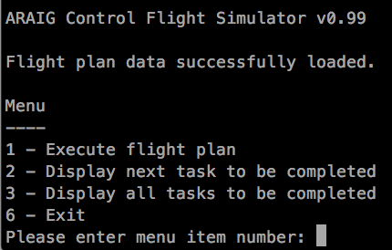
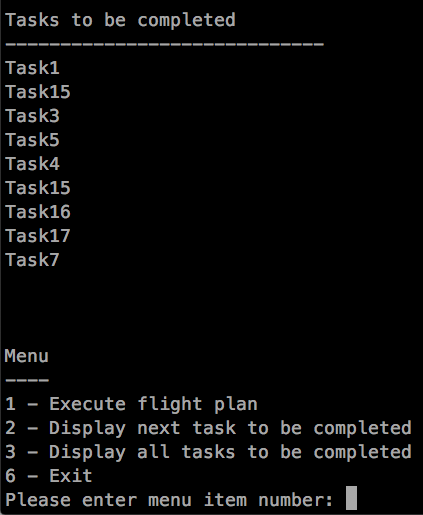
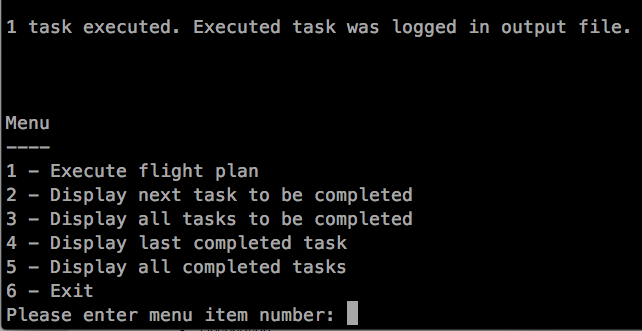
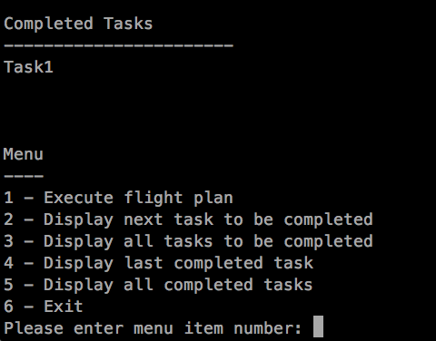

# As Real As It Gets Virtual Reality Suit Shell

The software was developed as a shel software for Seneca College's school of aviation flight simulation examination software.

## Instructions

Warning: the following instructions assume you are running a bash shell like terminal with clang++ compiler installed. For windows users please use _cygwin_ to gain similar functionality.

1. Download package and unzip if necessary
2. Open terminal and navigate to directory
3. Enter `make` command in terrminal
4. Enter `./araig (Stimulaton Configuration file) (Task Configuration file) (Profile Configuration) (output file)` in terminal to launch the app.

Names of the actual file should be used to substitue where ( ) are used.

Sample command for step 4:
`./araig StimulationConfig.csv TaskConfiguration.csv SampleProfileConfiguration.csv Output.txt`

Output.txt is where all the data written will be exported.

Note: If errors were encountered, consult with err_codes.txt for possible solutions.

## Screenshots

 
 
 

